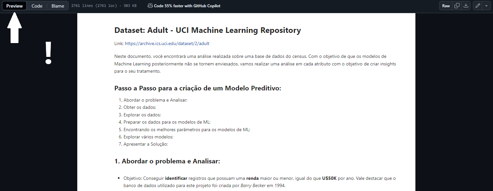

## Income Prediction 💵 - Dataset Census 

Nesse projeto, me dediquei a criar um algoritmo de Machine Learning capaz de classificar registros que possuam uma renda superior ou menor igual a U$50.000 por ano. No entanto, foi utilizado uma base de dados encontrado na *UCI Machine Learning Repository* e ela foi originada por *Barry Becker* em 1994. Contudo, para a realização desse projeto precisei realizar os seguites passos:

**1. Análise de Dados:** Entender como os dados estão distribuídos é essencial para que sejam bem tratados para os modelos.

**2. Tratamento dos Dados:** É de suma importância tratar os dados para que o aprendizado de máquina seja realizado.

**3. Treinamento dos Dados:** Neste ponto, os algoritmos irão ser treinados pelos dados tratados.

**4. Desempenho do Algoritmo:** Aqui, irá ser realizado uma avaliação com o objetivo de medir a capacidade de aprendizado de cada algoritmo.

**5. Testes:** Para evitar problemas de overfitting, será realizado mais uma vez testes com o propósito de medir o Desempenho dos algoritmos e determinar qual foi aquele que teve o melhor desempenho.

Essa base de dados possui **32561 registros** com **14 atributos previsores** e **1 classe**. Logo abaixo será exposto cada uma delas:

### Classe:

- income: >50K, <=50K.

### Atributos Previsores:

- age : continuous.
- workclass : Private, Self-emp-not-inc, Self-emp-inc, Federal-gov, Local-gov, State-gov, Without-pay, Never-worked.
- fnlwgt: continuous.
- education: Bachelors, Some-college, 11th, HS-grad, Prof-school, Assoc-acdm, Assoc-voc, 9th, 7th-8th, 12th, Masters, 1st-4th, 10th, Doctorate, 5th-6th, Preschool.
- education-num: continuous.
- marital-status: Married-civ-spouse, Divorced, Never-married, Separated, Widowed, - - - Married-spouse-absent, Married-AF-spouse.
- occupation: Tech-support, Craft-repair, Other-service, Sales, Exec-managerial, Prof-specialty, Handlers-cleaners, Machine-op-inspct, Adm-clerical, Farming-fishing, Transport-moving, Priv-house-serv, Protective-serv, Armed-Forces.
- relationship: Wife, Own-child, Husband, Not-in-family, Other-relative, Unmarried.
- race: White, Asian-Pac-Islander, Amer-Indian-Eskimo, Other, Black.
- sex: Female, Male.
- capital-gain: continuous.
- capital-loss: continuous.
- hours-per-week: continuous.
- native-country: United-States, Cambodia, England, Puerto-Rico, Canada, Germany, Outlying-US(Guam-USVI-etc), India, Japan, Greece, South, China, Cuba, Iran, Honduras, Philippines, Italy, Poland, Jamaica, Vietnam, Mexico, Portugal, Ireland, France, Dominican-Republic, Laos, Ecuador, Taiwan, Haiti, Columbia, Hungary, Guatemala, Nicaragua, Scotland, Thailand, Yugoslavia, El-Salvador, Trinadad&Tobago, Peru, Hong, Holand-Netherlands.

### Como ter acesso ao projeto?

1. Clique no direcionamento abaixo: recomendado para aqueles que não desejam baixar o projeto no próprio sistema. Lembrando que neste modo de acesso você será apenas direcionado para o arquivo no repositório.

  <a href="1data_analyses.ipynb">
    Clique aqui
  </a>

- Observação: Certifique se a opção "Preview" esteja habilitada para um melhor aproveitamento do documento.
  
</img>

